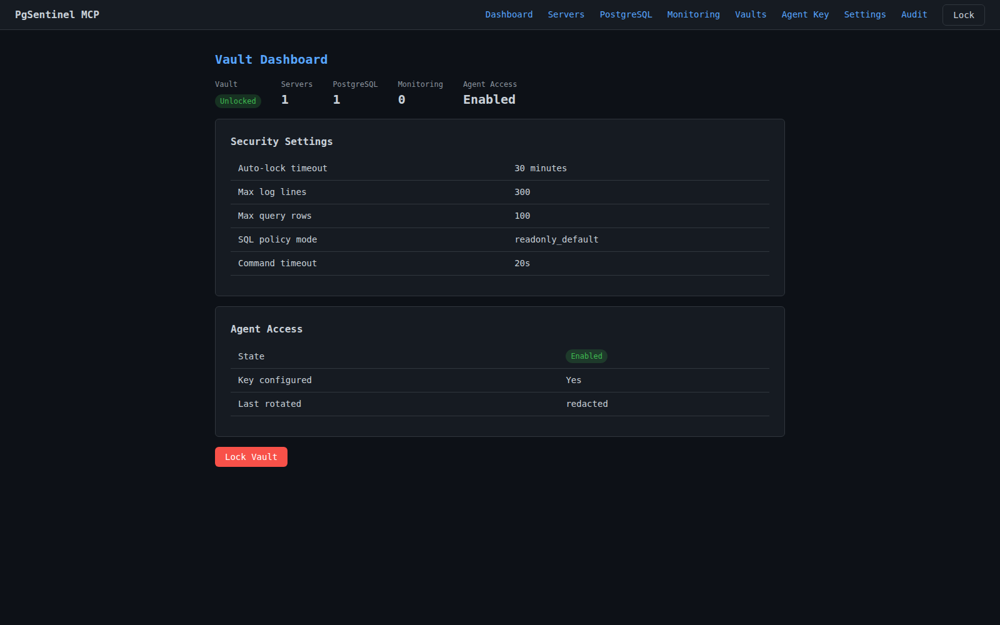
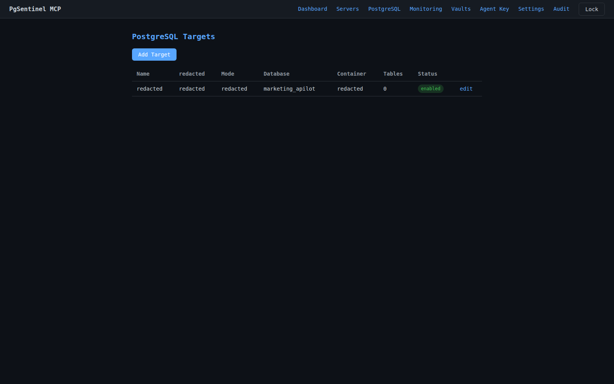
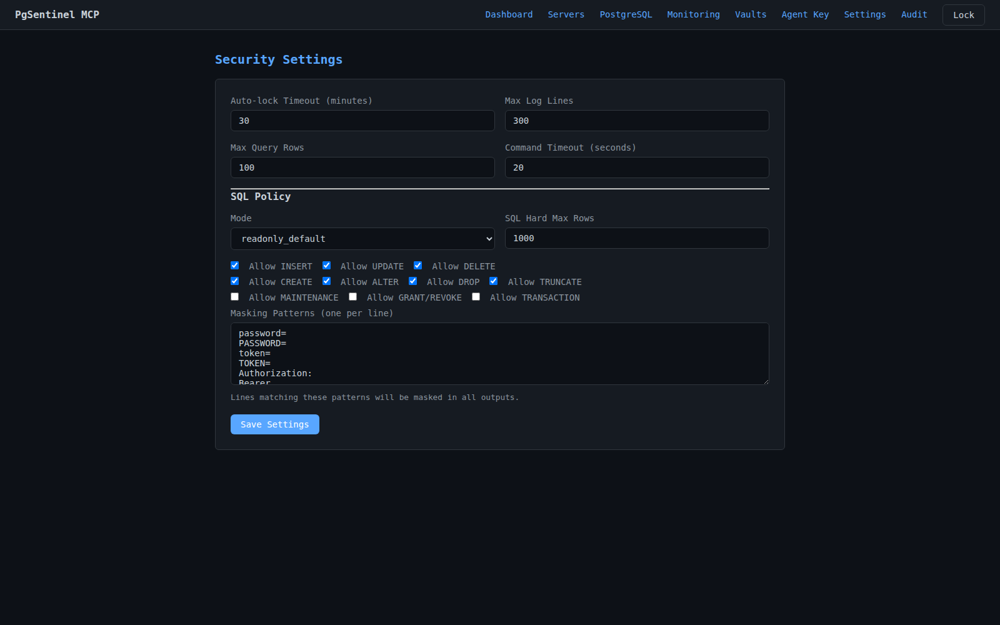
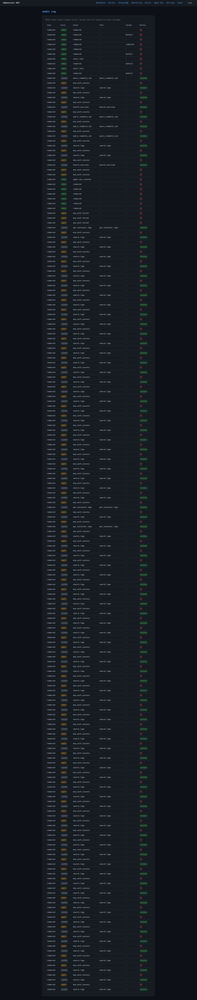

# PgSentinel MCP

[](LICENSE)
[](https://www.python.org/)
[](https://modelcontextprotocol.io/)

A security-first MCP server that gives AI agents (Claude, Codex, Cursor, and others) controlled, auditable access to Docker and PostgreSQL environments — without granting arbitrary shell or SQL access.



---

## Why PgSentinel

In real production incidents, AI agents speed up diagnosis — but unrestricted shell or database access is a serious risk.

PgSentinel sits between the agent and your infrastructure:

- Agents call pre-defined, read-only diagnostic tools.
- All targets (servers, containers, tables) are declared in an encrypted vault and allowlisted.
- Every call is audit-logged. No action happens silently.
- The operator stays in control of what agents can see and do.

---

## Features

- **Docker diagnostics** — container list, logs, error search, restart counts, deployment info
- **PostgreSQL diagnostics** — health check, schema discovery, table description, sample rows, migration history, failed jobs
- **Policy-guarded SQL** — `query_readonly_sql` with `readonly_default` / `guarded_write` modes, per-category toggles, and hard row caps
- **Encrypted vault** — Argon2id + AES-256-GCM, master-password protected, auto-locking
- **Web admin panel** — manage servers, PostgreSQL targets, monitoring endpoints, agent keys, and SQL policy
- **Multi-vault support** — switch, import, and export named vaults from the UI
- **Full audit trail** — every admin action and MCP tool call logged to JSONL, secrets never written
- **Secret masking** — all tool output is scrubbed for common credential patterns before returning to the agent

---

## Security Model

```
Operator
  → Web panel (/admin/*)
  → Master password
  → Manages vault, targets, and agent keys

AI Agent (Claude / Codex / Cursor / …)
  → MCP endpoint (/mcp)
  → Agent API Key (pgs_ai_...)
  → Read-only diagnostic tools only
```

The agent **cannot**:
- Access the admin panel
- Unlock or read the vault
- Run arbitrary shell commands
- Issue unrestricted SQL
- Reach any target not pre-declared in the vault

---

## Screenshots

| Login | Dashboard | Servers |
|-------|-----------|---------|
|  |  |  |

| PostgreSQL targets | Settings | Audit log |
|--------------------|----------|-----------|
|  |  |  |

---

## Quick Start

### Docker Compose (recommended)

```bash
git clone https://github.com/your-org/pgsentinel.git
cd pgsentinel
cp .env.example .env          # adjust paths if needed
docker compose up -d --build
```

Open `http://127.0.0.1:8088/admin/setup` to create the master password and first agent key.

Health check:

```bash
curl -sS http://127.0.0.1:8088/health
```

### Prerequisites

- Docker + Docker Compose, **or** Python 3.11+
- For SSH-based targets: network access to the remote server, an SSH key for a read-only user
- For direct PostgreSQL targets: network access to the database (VPN, private network, or TLS)

### Local development (without Docker)

```bash
python -m venv .venv && source .venv/bin/activate
pip install -e ".[dev]"
PGSENTINEL_VAULT=/tmp/pgsentinel-dev.enc \
PGSENTINEL_AUDIT_LOG=/tmp/pgsentinel-dev-audit.jsonl \
uvicorn app.main:app --host 127.0.0.1 --port 8088
```

---

## MCP Client Integration

PgSentinel uses **Streamable HTTP** MCP transport.

| Setting | Value |
|---------|-------|
| Endpoint | `http://127.0.0.1:8088/mcp/mcp` |
| Transport | Streamable HTTP |
| Auth header | `Authorization: Bearer pgs_ai_...` |
| Accept header | `application/json, text/event-stream` |

Session flow: send `initialize` first, then include the returned `mcp-session-id` header on every subsequent request.

See the full integration guide: [docs/mcp_client_guide.md](docs/mcp_client_guide.md)

### Minimal curl example

```bash
# 1) Initialize — note the mcp-session-id in the response headers
curl -i -sS \
  -H "Authorization: Bearer pgs_ai_YOUR_KEY" \
  -H "Content-Type: application/json" \
  -H "Accept: application/json, text/event-stream" \
  -X POST http://127.0.0.1:8088/mcp/mcp \
  -d '{"jsonrpc":"2.0","id":1,"method":"initialize","params":{"protocolVersion":"2025-03-26","capabilities":{},"clientInfo":{"name":"demo","version":"1.0"}}}'

# 2) Call a tool
curl -sS \
  -H "Authorization: Bearer pgs_ai_YOUR_KEY" \
  -H "mcp-session-id: SESSION_ID_FROM_STEP_1" \
  -H "Content-Type: application/json" \
  -H "Accept: application/json, text/event-stream" \
  -X POST http://127.0.0.1:8088/mcp/mcp \
  -d '{"jsonrpc":"2.0","id":2,"method":"tools/call","params":{"name":"health_overview","arguments":{}}}'
```

---

## Available MCP Tools

### Docker & infrastructure

| Tool | Description |
|------|-------------|
| `health_overview` | Overall health status across configured targets |
| `get_docker_containers` | List containers and their state |
| `get_deployment_info` | Current image tags and deploy timestamps |
| `get_container_image_info` | Image details for a specific container |
| `get_container_status` | Running/stopped/unhealthy status |
| `get_container_restart_count` | Restart count for a container |
| `get_container_logs` | Raw log lines from a container |
| `search_logs` | Full-text search across logs |
| `get_recent_errors` | Recent error-level log lines |
| `get_errors_grouped` | Error lines grouped by pattern |
| `get_logs_since_deploy` | Log lines since the last deploy event |

### PostgreSQL

| Tool | Description |
|------|-------------|
| `get_postgres_health` | Connection check and basic DB stats |
| `list_allowed_tables` | Tables available to the agent |
| `describe_table` | Column names and types for a table |
| `get_table_sample` | Sample rows (masked) from an allowed table |
| `get_recent_migrations` | Latest migration history entries |
| `get_failed_jobs` | Failed background job rows |
| `get_table_row_count` | Row count for an allowed table |
| `query_readonly_sql` | Policy-guarded SQL (must be enabled per target) |

### Diagnosis

| Tool | Description |
|------|-------------|
| `diagnose_recent_failure` | Cross-source failure diagnosis (logs + DB) |
| `diagnose_deployment_issue` | Deployment-specific failure signals |
| `diagnose_worker_issue` | Background worker failure signals |
| `diagnose_database_issue` | Database connectivity and health signals |
| `diagnose_http_5xx_issue` | HTTP 500-class error pattern analysis |

### Source inspection

| Tool | Description |
|------|-------------|
| `check_source_contains` | Check if an allowlisted source file contains a pattern |
| `check_python_symbols_in_module` | List symbols in an allowlisted Python module |

---

## Connection Modes

Targets in the vault can use any of the following modes:

| Mode | Description |
|------|-------------|
| `local` | Local Docker CLI (dev/testing) |
| `ssh` | Paramiko SSH to a remote server |
| `docker_exec_psql_over_ssh` | SSH → `docker exec psql` |
| `ssh_tunnel_direct_postgres` | SSH tunnel + direct psycopg |
| `postgres_direct_tcp` | Direct TCP psycopg (private network / VPN) |
| `postgres_direct_tls` | Direct TLS psycopg |
| `https_api` | HTTP requests with Bearer token |
| `monitoring_endpoint` | HTTP health check endpoint |

---

## Example Agent Workflows

**Incident triage**
```
health_overview          → check global status
get_docker_containers    → detect unhealthy or stopped containers
get_recent_errors        → pull the latest error lines
diagnose_recent_failure  → cross-reference logs and DB for a likely cause
```

**PostgreSQL investigation**
```
get_postgres_health      → verify connectivity
list_allowed_tables      → see what the agent can access
describe_table           → inspect schema for a specific table
get_table_sample         → look at masked sample rows
query_readonly_sql       → run a policy-approved SELECT (if enabled)
```

**Deployment check**
```
get_deployment_info      → confirm which image version is running
get_logs_since_deploy    → review logs since the last deploy
get_recent_migrations    → check that migrations applied cleanly
```

---

## Deployment

See [docs/deployment.md](docs/deployment.md) for:
- Full Docker Compose configuration
- Multi-vault mode
- SSH known-hosts persistence
- Vault backup guidance
- Production hardening checklist

---

## Documentation

| Document | Description |
|----------|-------------|
| [docs/deployment.md](docs/deployment.md) | Deployment, multi-vault, SSH trust, backup |
| [docs/mcp_client_guide.md](docs/mcp_client_guide.md) | Connecting agents to PgSentinel |
| [docs/technical_reference.md](docs/technical_reference.md) | Module map, security boundaries, connection modes |
| [docs/testing.md](docs/testing.md) | Running tests and verifying changes |
| [CONTRIBUTING.md](CONTRIBUTING.md) | How to contribute |
| [CHANGELOG.md](CHANGELOG.md) | Release history |

---

## Contributing

Contributions are welcome. Please read [CONTRIBUTING.md](CONTRIBUTING.md) before opening a pull request.

To report a security vulnerability, do **not** open a public issue — contact the maintainer directly.

---

## License

MIT — see [LICENSE](LICENSE).
